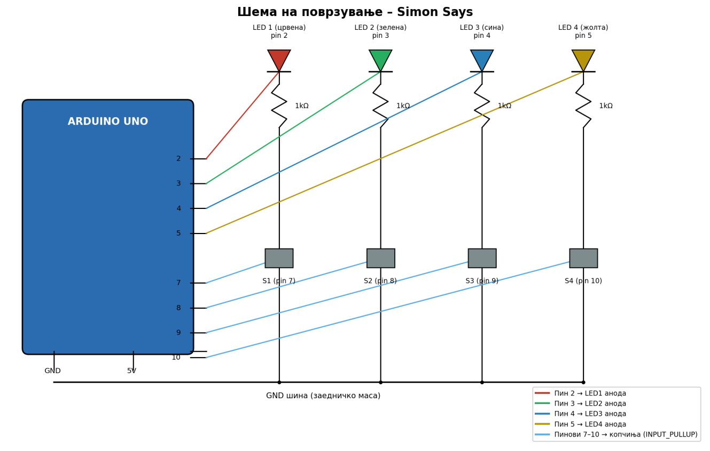
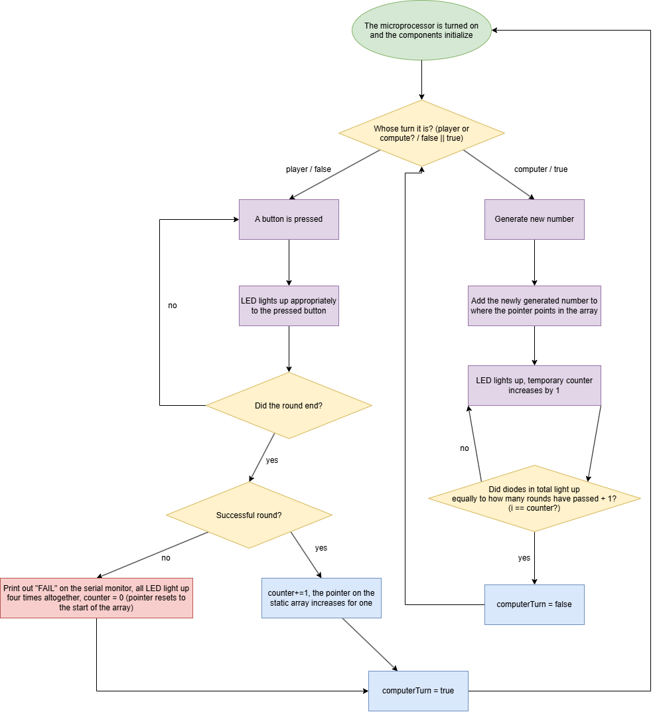

# Simon Says: Arduino UNO Memory Game

An electronic version of the classic "Simon Says" memory game, built on an Arduino UNO with 4 LEDs and 4 push buttons. The board plays a random sequence of light flashes, and the player has to repeat it in the exact same order. Every successful round adds one more step to the sequence.

> **Faculty of Computer Science and Engineering - Skopje**  
>Course project for **Computer Electronics**  
> **Student:** Stefan Sekulov  
> **Mentor:** Prof. Dr. Lasko Basnarkov  
> **Presented:** 11 September 2026

---

## Table of contents

1. [Goal](#goal)
2. [Hardware](#hardware)
3. [Wiring](#wiring)
4. [How it works](#how-it-works)
5. [Source code](#source-code)
6. [How to run it](#how-to-run-it)
7. [Testing](#testing)
8. [Limitations and future work](#limitations-and-future-work)

---

## Goal

The goal is to design and implement a working memory game on the Arduino UNO platform. The game tests the player's visual memory: the system generates a random sequence of LED flashes, and the player must repeat it by pressing the matching buttons in the correct order.

The project covers these digital and embedded electronics concepts:

- **Digital outputs** to drive LEDs
- **Digital inputs with the internal pull-up resistor** (`INPUT_PULLUP`) to read buttons without external resistors
- **Pseudo-random number generation** (`random()`, `randomSeed()`), seeded from an unconnected analog pin so each power-up produces a different sequence
- **Storing and processing a sequence** of game states in a fixed-size array
- **A two-state game loop:** the computer's turn (state 1) and the player's turn (state 2)

---

## Hardware

| Component | Qty | Purpose |
|-----------|-----|---------|
| Arduino UNO | 1 | Main controller board |
| LEDs (different colours) | 4 | Game output, connected to pins 2, 3, 4, 5 |
| 1 kΩ resistors | 4 | One in series with each LED (cathode side) |
| 4-pin push buttons | 4 | Player input, connected to pins 7, 8, 9, 10 (only 2 of the 4 legs are needed) |
| Breadboard | 1 | Mounting the components |
| Jumper wires | 18 | Connecting everything to the pins and GND |
| USB cable | 1 | Uploads the code and powers the board |

---

## Wiring

Each LED's **anode** connects directly to a digital pin on the Arduino. Its **cathode** goes through a **1 kΩ resistor** to the common GND rail on the breadboard.

Each button connects between a digital input pin and **GND**. The Arduino's internal pull-up resistor is enabled (`INPUT_PULLUP`), so a pin reads `HIGH` when the button is released and `LOW` when it is pressed.

*(Diagram labels are in Macedonian: "Шема на поврзување" = "Wiring diagram", "GND шина (заедничко маса)" = "common GND rail".)*

### Pin map

| Arduino pin | Component | Mode |
|-------------|-----------|------|
| 2 | LED 1 (red) | `OUTPUT` |
| 3 | LED 2 (green) | `OUTPUT` |
| 4 | LED 3 (blue) | `OUTPUT` |
| 5 | LED 4 (yellow) | `OUTPUT` |
| 7 | Button 1 | `INPUT_PULLUP` |
| 8 | Button 2 | `INPUT_PULLUP` |
| 9 | Button 3 | `INPUT_PULLUP` |
| 10 | Button 4 | `INPUT_PULLUP` |
| A0 | *(left unconnected)* | Only used for `randomSeed()` |

---

## How it works

The program alternates between two states, controlled by the `computerTurn` flag:

1. **Start:** the board powers on, initialises the pins, and begins with `computerTurn = true`.
2. **Computer's turn:** it replays the whole sequence so far, then generates a new random number (0 to 3), appends it to the sequence, and flashes it. The sequence is also printed to the Serial Monitor. Then `computerTurn = false`.
3. **Player's turn:** the player presses the buttons in the same order. Each press is checked by `press_btn()`, which accepts a button only if it is the *only* one reading `LOW` while the other three read `HIGH`.
4. **Wrong button:** the game prints `Fail` to the Serial Monitor, flashes all four LEDs (`blinkAllFour()`), and resets the sequence (`counter = 0`).
5. **Whole sequence repeated correctly:** `computerTurn = true` again, and the computer adds one more step, so the game gets harder every round.

### Program flow

---

## Source code

The full sketch is in [`src/simon_says.ino`](src/simon_says.ino).

Design notes:

- The sequence is stored in a **fixed-size array** (`int sequence[32]`) instead of a dynamic structure, which is the safer choice on a microcontroller with very little RAM. This also limits the game to **32 rounds**.
- `lastState` is used so that one physical press is only registered once, even if the button is held down for several loop iterations.
- Buttons use `INPUT_PULLUP`, so no external pull-up resistors are needed.

---

## How to run it

1. Build the circuit as shown in the [wiring diagram](#wiring).
2. Install the [Arduino IDE](https://www.arduino.cc/en/software).
3. Open `src/simon_says.ino`.
4. Select **Tools → Board → Arduino UNO** and the correct port.
5. Click **Upload**.
6. (Optional) Open the **Serial Monitor** to see the generated sequence each round and the `Fail` message.

No external libraries are required.

---

## Testing

The project was tested manually with the Arduino UNO connected to a computer over USB, using the Serial Monitor to check the generated sequence in every round.

| Scenario | Result |
|----------|--------|
| Player repeats the sequence correctly | The game continues and one more step is added |
| Player presses a wrong button on purpose | Failure detected, all LEDs flash, sequence resets (`counter` goes back to 0) |
| Sequence grows gradually | Behaves correctly with longer sequences, up to the maximum of 32 steps / 32 rounds |

---

## Limitations and future work

- **Prototype only:** the circuit is on a breadboard with no soldered connections, so wires can come loose, and the components are not enclosed. A finished version should be soldered (or moved to a PCB) and placed in an enclosure, and that packaging should be done *before* final testing.
- **Fixed maximum length:** the sequence array holds 32 steps, so the game stops scaling after 32 rounds.
